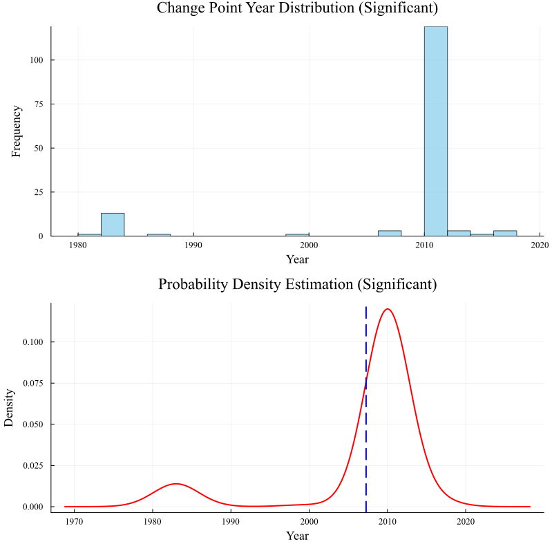
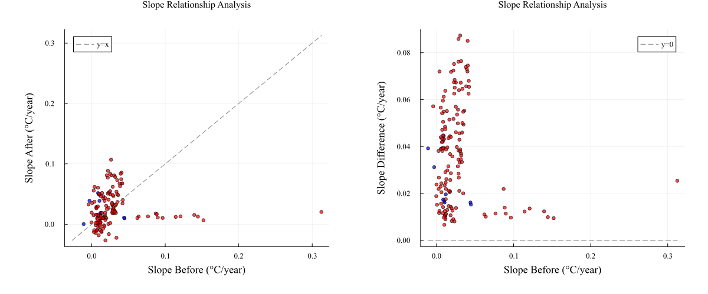

# 11 / 07 / 2025

---
layout: center
---

## ERA5-Land: Lake mix-layer temperature

::left::

- 通过 [ERA5-Land Lake cover]{.text-blue-400} 常量进行湖泊提取（又是连通域）
  - Lake cover >= 0.8 && 像元数量 >= 2 == 湖泊
  - 237 个湖泊
- 对于湖泊们，获取 Lake mix-layer temperature 时间序列（月均，所有像元平均）
- 平均到年，检测趋势突变点（右图）

::right::

---
layout: center
---

